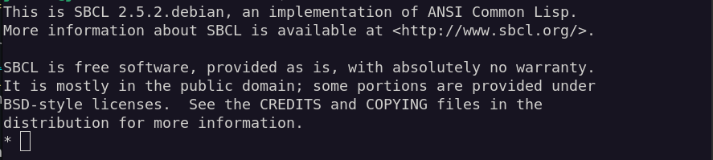
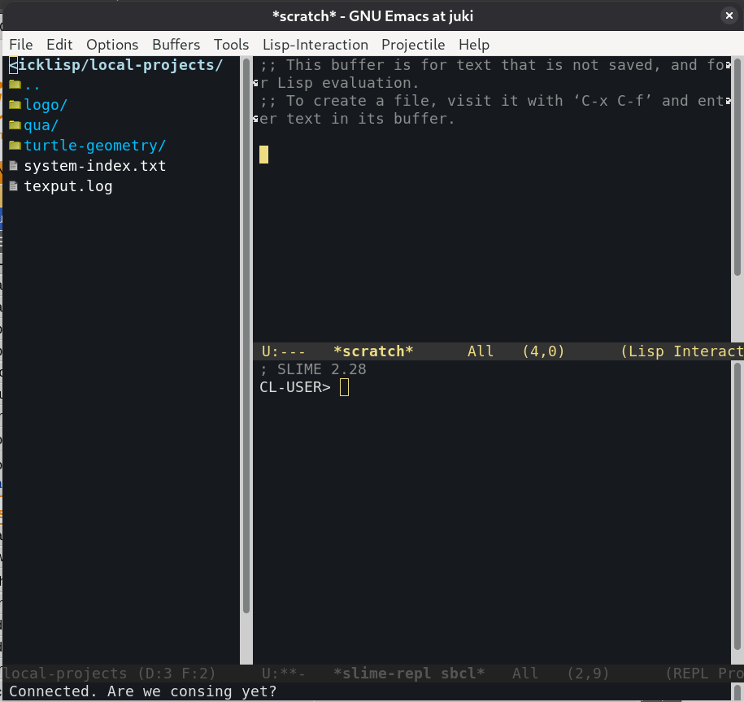

# Portaclish  

A simple `init.el` script for preconfiguring **Emacs** as a Common Lisp IDE —
  inspired by [Shinmera’s Portacle IDE](https://portacle.github.io/)
  configuration.  

The original *Portable Common Lisp Environment* project has [fallen
asleep](https://www.reddit.com/r/Common_Lisp/comments/uphlgw/is_portacle_being_maintained/)
and now
[abandoned](https://mastodon.social/@miguel@lemmy.ml/115097648782234707), 
but its ideas remain helpful. Portaclish takes up this inspiration and shows how
to configure **Emacs** into a comfortable Integrated Development Environment (IDE). 

Meanwhile, [Shinmera](https://shinmera.com/) has advanced their own Emacs configuration. Professionals and ambitious amateurs might want to explore [that setup](https://codeberg.org/shinmera/.emacs).  

For **beginners**, however, those configs may be overwhelming.  
That’s why *this repo exists*: for pedagogical purposes and less advanced needs, as a **useful, portable starting point**.  

The provided `init.el` is surely optimisable, but it works — at least on my system (Debian Linux 13). Packages are managed with `use-package`, and while this isn’t a full USB-stick-based environment, the configuration is portable between fixed installations on Linux, macOS, and Windows.  

---

## 🚀 Quickstart  

If you’re impatient:  

1. Install **Emacs** and **SBCL** (Steel Bank Common Lisp).  
2. Download [Quicklisp](https://www.quicklisp.org/beta/) and install it into SBCL.  
3. Drop this repo’s `init.el` into your `~/.emacs.d/` (or equivalent on Windows).  
4. Start Emacs → it will auto-install everything and open ready for Lisp.  

For details, follow the full guide below.  

---

## Guide  

This section is meant for **beginners in both Common Lisp and Emacs**.  
If you already know what to do with the source code, feel free to skip ahead.  

---

### 1. Install Emacs  

- [Download Emacs](https://www.gnu.org/software/emacs/) according to your OS.  
- [Windows 11 install guide](https://lucidmanager.org/productivity/emacs-windows/) (similar for Windows 10).  
- [GNU instructions for
Windows/macOS](https://www.gnu.org/software/emacs/download.html#nonfree).  
- Linux/macOS: use your package manager (e.g. `apt` on Debian/Ubuntu).  

macOS users can also use:  
- [MacPorts](https://ports.macports.org/port/emacs/)  
- [Homebrew](https://formulae.brew.sh/formula/emacs)  

Windows users might also try the [Windows Subsystem for Linux
(WSL)](https://learn.microsoft.com/en-us/windows/wsl/install) for smoother
package management. 

---

### 2. Install a Common Lisp implementation

The arguably most frequently used free implementation is [SBCL (Steel Bank Common
Lisp)](https://www.sbcl.org/). 

- Linux/macOS: use your package manager.
- macOS: [MacPorts](https://ports.macports.org/port/sbcl/) or
  [Homebrew](https://formulae.brew.sh/formula/sbcl).
- Windows: [download the binary from
SourceForge](https://sourceforge.net/projects/sbcl/files/sbcl/). 

Now test your installation by starting it in a terminal:

```
$ sbcl
```

This starts the REPL (Read-Eval-Print-Loop) that looks similar to this:



Enter your very first Lisp expression at the REPL prompt -- the blinking cursor
after the Asterisk: 

```
* (quit)
```

And you’re out again. 🎉

> *Common Lisp* is a programming language defined by the comprehensive **ANSI
> Common Lisp** standard. SBCL is one implementation of this standard -- there are
> others too. Each implementation often adds its own non-standard extensions, and
> some only partially follow the standard. SBCL, however, is ANSI compliant and
> known for its speed. 

### 3. Install cURL (probably already there)

On most systems ```curl```is preinstalled. If not:

* macOS: [MacPorts](https://ports.macports.org/port/curl/),
  [Homebrew](https://formulae.brew.sh/formula/curl#default). 
* Linux: distribution's package manager.
* Windows: [download here](https://curl.se/windows/)

### 4. Install Quicklisp (the Common Lisp library manager)

Follow the steps on the [Quicklisp site](https://www.quicklisp.org/beta/). In
short: 

Download [quicklisp.lisp](https://beta.quicklisp.org/quicklisp.lisp) and 
[quicklisp.asc](https://beta.quicklisp.org/quicklisp.lisp.asc) with
```curl```into your home directory.  

Verify ```quicklisp.lisp``` with ```quicklisp.asc``` using ```gpg``` on the console. 

And then load ```sbcl``` by passing ``` quicklisp.lisp``` to it:

```
$ sbcl --load quicklisp.lisp
```

Then inside the REPL enter first:

```
* (quicklisp:quickstart-install)
```

After the installation process is finished, enter:

```
* (ql:quickload "quicklisp-slime-helper")
```

and follow the instructions it displays.

Finally, enter this expression:

```
* (ql:add-to-init-file)
```

Now SBCL will always start with Quicklisp loaded which is already preconfigured
for a further step below. You can leave the REPL again with ```(quit)```. 

> Quicklisp is the de-facto package manager for Common Lisp. It downloads and
> installs libraries, keeps track of dependencies, and makes it easy to share and
> load code — much like pip in Python or npm in JavaScript.


### 5. Start vanilla (unconfigured) Emacs

Open Emacs the usual way (icon or terminal).
Quit it with your **first Emacs keychord**: ```C-x C-c```

> ```C-``` means: *Hold ```<Ctrl>```*. The small letters reference the
> corresponding keys ```<x>``` and ```<c>```.

Find the configuration directory:

* Linux/Unix/macOS: ```~/.emacs.d```
* Windows (usually): ```C:\Users\<yourname>\.emacs.d\``` or
  ```C:\Users\<yourname>\AppData\Roaming\.emacs.d\``` 

Inside ```emacs.d``` create the subdirectory ```slime-contribs```.

### 6. Save the ```init.el```

* Put the provided ```init.el``` into ```~/.emacs.d/``` (***not***
  ```~/.emacs.d/slime-contribs```). 
* Open it with another editor (not Emacs yet).
* Notice the comments (```;``` introduces them).

👉 Windows users: replace ```/``` in pathnames with ```\```.

### 7. Run Emacs with *portaclish* flavour:

Restart Emacs. It should:

* Install required packages (you can follow the process in the bottom line, the
  *minibuffer*). 
* Switch to dark mode.
* Open with ```scratch``` buffer + SLIME REPL + file manager (toggle with
  ```<F8>```). 
  
> SLIME stands for Superior Lisp Interaction Mode for Emacs. Think of it as a
> “remote control” for Common Lisp: it enhances the REPL to be much more
> comfortable, and even lets you run and manage several Lisp instances in
> parallel.

If everything worked, Emacs should look something like this:



---

## Final notes

* This configuration is a teaching tool and starting point.
* It is intentionally simpler than professional configs, but functional enough
  for real work. 
* Upcoming: links to a YouTube tutorial series (Emacs + Common Lisp, later also
  JavaScript and LaTeX). 
