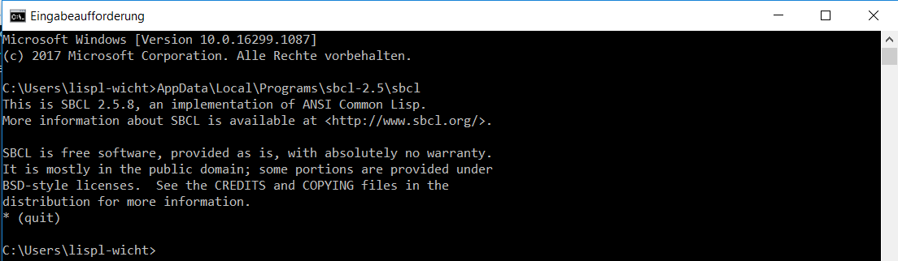

# Prepare the environment in Windows for configuring the portaclish Emacs IDE

Windows is designed to feel simple for end-users, but this often makes it clumsy
when you want to use it in a Unix/Linux-like way.
To ensure a smooth connection between Emacs and SBCL, we need to do a bit of
setup first. 

This guide is written with beginners in mind. Some explanations may feel overly
detailed if you are experienced — but the extra clarity helps avoid common
pitfalls. 

## 1. Install Steel Bank Common Lisp (SBCL) and localise it

1. We simply start by installing the ```.msi``` file of the latest sbcl version we
   [downloaded from here](https://sourceforge.net/projects/sbcl/files/sbcl). 
   This will extract the relevant files in 
   ```C:\Program Files\Steel Bank Common Lisp```. 
2. Path names with spaces make troubles in our *Emacs* configuration.  That's why we
   **make a copy** of this directory in our ```Users``` directory.
   To achieve this, we open the file explorer and let us display hidden files
   and directories first.  Therefore, we click the ```View``` tab and check the
   ```Hidden items``` box.
   

   
3. We now see in our ```C:\Users\YourUserName\``` directory the hidden directory
   ```AppData```.  (Please  look for *your* user name at your computer instead
   of the dummy ```YourUserName``` used here as a place holder.)
4. Now, we navigate into the subdirectory
   ```C:\Users\YourUserName\AppData\Local\Programs```. 
   

   
5. By pressing ```Ctrl```+```n``` (or in Emacs notation: ```C-n```), we open a new
   file explorer window. There, we navigate to ```C:\Program Files\Steel Bank
   Common Lisp```. And we *copy* that *directory* with ```Ctrl```+```c```
   (i.e. ```C-c```).
   

   
6. We click into our first file explorer window with
   ```C:\Users\YourUserName\AppData\Local\Programs```, and insert the copy
   with ```Ctrl```+```v``` (i.e. ```C-v```).
7. We *rename* this subdirectory from ```Steel Bank Common Lisp``` to something like 
   ```sbcl-2.x``` (according to the downloaded version of SBCL).


## 2. Start the local SBCL from the *Emacs home directory*

> **Note on prompts:**
> In this guide, lines starting with ```>``` show the Windows command prompt.
> Lines starting with ```*``` show the SBCL prompt.
> Do not type the prompt symbol itself -- only what follows it.
> (However, I will mention it again at the respective positions.)

1. We press the so-called "Windows" key. Now, we enter ```cmd``` for the
   *command prompt* -- also called *shell*, or *console*, or *terminal*.
   And then we click on the symbol that appears.
   

   
2. The opened shell window should give us a prompt in *our* ```Users``` directory:

```
C:\Users\YourUserName>
```

After the ```>``` we enter our commands. That's why from now on I will indicate the
prompt with

```
>
```

And we enter only the things that *follow* this prompt sign.


4. In the current directory we enter:

```
>AppData\Local\Programs\sbcl-2.x\sbcl
```

**Notice:** 
* Again: **Do not** enter the ```>```.
* Replace ```sbcl-2.x``` with the local sbcl directory name you chose
  above.
* Calling the local ```sbcl``` like this works, because ```AppData``` is a subdirectory
  of ```C:\Users\YourUserName```.  So, we can use the *relative* path from there.
  
5. At the appearing prompt **of SBCL** we enter ```(quit)``` and leave SBCL
   again.
   
Our shell now will look quite similar to this:



## 3. Installing Git

1. We download [Git](https://git-scm.com/downloads/win).
2. After installation, our ```C:\Users\YourUserName\AppData\Local\Programs```
   will look like this:
   


## 4. Installing Quicklisp (also consider the [README.md](README.md))

1. We download the file
   [quicklisp.lisp](https://beta.quicklisp.org/quicklisp.lisp) and move it with
   our file explorer into ```C:\Users\YourUserName\AppData\Roaming```.
2. **In our shell** we *change directory* (```cd```) correspondingly with:

```
>cd AppData\Roaming
```

3. Then we start SBCL again with an argument (mind the dots at the beginning
   and the ```--load``` option at the end):

```
>..\Local\Programs\sbcl-2.x\sbcl --load "quicklisp.lisp"
```

4. *At the SBCL prompt*, we enter (*after* the ```*```):

```
* (quicklisp-quickstart-install)
```

5. After the installation is complete, we enter:

```
* (ql:quickload "quicklisp-slime-helper")
```

6. After this process is finished, we ensure *Quicklisp* to be permanently
   loaded with SBCL:
   
```
* (ql:add-to-init-file)
```

7.We quit SBCL again:

```
* (quit)
```

8.At the *command prompt*, we enter this line:

```
>move .sbclrc ..\..
```

9. With the *file explorer*, we navigate to ```C:\Users\YourUserName``` and open
   ```.sbclrc``` with the ```notepad``` editor.
   
The original content looks like this:

```

;;; The following lines added by ql:add-to-init-file:
#-quicklisp
(let ((quicklisp-init (merge-pathnames "quicklisp/setup.lisp"
                                       (user-homedir-pathname))))
  (when (probe-file quicklisp-init)
    (load quicklisp-init)))
```

We modify the pathname after ```merge-pathnames```, so that the whole expression
looks like this:

```

;;; The following lines added by ql:add-to-init-file:
#-quicklisp
(let ((quicklisp-init (merge-pathnames "AppData/Roaming/quicklisp/setup.lisp"
                                       (user-homedir-pathname))))
  (when (probe-file quicklisp-init)
    (load quicklisp-init)))
```

10. We save the file and exit ```notepad```.


## 5. Installing Emacs, starting it for the first time, and adding a subdirectory

1. We either visit a [GNU Emacs FTP Mirror
   nearby](http://ftpmirror.gnu.org/emacs/windows) -- which is recommended. Or,
   if no mirror is available for a longer time, we go to the [main FTP
   server](http://ftp.gnu.org/gnu/emacs/windows/) -- which often is slower.
2. On the FTP server, we may choose the subdirectory of the newest *Emacs*
   version:
   


3. Within that directory, we may download the newest install file:


After executing that file, *Emacs* will be installed into 
```C:\Program Files\Emacs\emacs-30.2\bin``` (look for the ```emacs-xx.x``` that fits in
   your case). 
   
4. **Navigate to that directory** with the file explorer, and click the **file**
   ```emacs``` with the **right** mouse button.  Choose "pin to the taskbar",
   and a starter icon is added to the very taskbar.
   
5. Now, start *Emacs* for the first time.

6. Close *Emacs* again (just click the *Emacs* window's close button in the
   upper right corner, right now).
   
7. At the **command prompt** enter this:

```
>mkdir .emacs.d/slime-contribs
```
 
## 6. Configuring *Emacs* by downloading the portaclish ```init.el```

1. We open the ```init.el-windows``` in
   the 
   [repository](https://github.com/Lispl-Wicht/Portaclish/blob/main/init.el-windows).
2. We click the download button, marked red below:


3. With the file explorer, we move that file from our download directory into the
   *Emacs* configuration directory:

```
C:\Users\YourUserName\AppData\Roaming\.emacs.d
```

4. We open this ```init.el-windows``` with the ```notepad``` editor, and push
   ```Ctrl```+```f``` (```C-f```) to enter the following search string:
   
   ```
   Replace YourUserName
   ```
   
5. We follow the instructions of the comments in lines 262--264:

   ```
   ;;;; ********************************************************************************
   ;;;; Replace YourUserName with *your* user name!!!
   ;;;; And replace 'sbcl-2.5' with the directory name *you* have chosen!!!
   ```
   
   which refer to the **two** paths in the following expression:
   
   ```
   '((sbcl ("c:/Users/yourUserName/AppData/local/Programs/sbcl-2.5/sbcl.exe"
            "--core"
            "c:/Users/yourUserName/AppData/local/Programs/sbcl-2.5/sbcl.core")))
   ```
   
   As you can see: *Emacs* handles ```/``` in windows pathnames as if they were
   ```\```.  So, in *Emacs* the Unix convention can be applied.  (If you insist
   in using backslashes, you need *to mask* them with an additional one: ```\\```.)
6. Now, save the file and exit.
7. **Rename** the file into ```init.el``` within the file explorer.
8. Start *Emacs* and wait.

If everything works -- like it did in my case (after long hours of try, error and
search  in my personal Nemesis Windows) --
the result should look similar to this, after a while of downloading and configuring:


## Final Notes

What have we done?

* The configuration file ```.sbclrc``` is searched by SBCL in the users
  *Windows* Home directory, which is ```C:\Users\YourUserName```.  This
  directory is the *return value* of the *Common Lisp* function
  ```(user-homedir-pathname)```. -- If we want SBCL to load quicklisp 
  at startup, this file needs to be there.
* *Emacs* instead treats ```C:\Users\YourUserName\AppData\Roaming``` as Home. If
  we work in that environment, it is more convenient if Quicklisp is also in the
  *Emacs* Home dir. The *Quicklisp* library is installed in that directory in
  which ```quicklisp.lisp``` is saved. And later ```(ql:add-to-init-file)```
  also creates the ```.sbclrc``` there.
* A simple solution is to change into the *Emacs* Home dir, let the installation
  process take place there, move the generated .sbclrc to the *Windows* User
  Home dir. And, to modify that configuration file so that it names the
  *Quicklisp* installation in the *Emacs* Home dir -- like we've did in the 4th
  section step 9.
* If this turns out to be a less favourable decision in general, it easily can
  be modified: Just copy, or move the ```quicklisp``` subdirectory into the
  *Windows* Home dir, and modify the ```#-quicklisp```-entry in ```.sbclrc```
  correspondingly again. 
  
Ok, and why an additional local copy of SBCL, again?

* I did not find a way how to convince Emacs to handle pathnames that contain
  space characters in the ```init.el```.  The suggested ideas with masked
  backslashes did not work out.
* Finding the correct Windows path entries for SBCL needed quite an
  uncomfortable time of tinkering with several variations. I am glad, that this was
  mentioned at Stackoverflow or so in a comment. It is also a good model for
  adding further *Common Lisp* implementations on Windows. It is only important,
  that the pathnames are correctly modified to the own system (step 5 of the 6th
  section).
* But to use the subdirectory ```Local\Programs\sbcl-2.5``` has a big advantage
  anyway:  It is more convenient to change to that directory in the first place.
* To keep the global installation allows to start it also from the start menu,
  which also could become convenient, if Emacs later will be connected to that
  instance as well.
* *Git* by the way is not needed necessarily. But the ```init.el``` also uses the package
  ```Magit``` -- the *Emacs* interface to *Git*.  And so, besides the future
  convenience, the absence of *Git* would result in an unnecessary error message.

